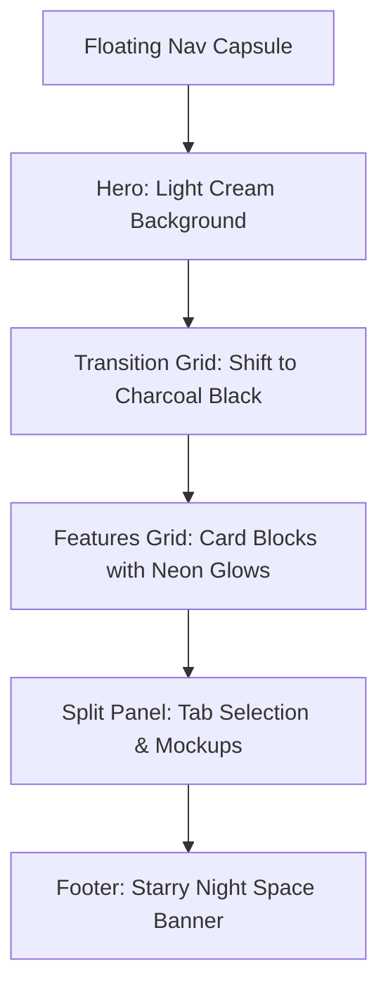

# Design Analysis: dynamic-biscuits-252502.framer.app

This document provides a detailed breakdown of the visual system, user experience structure, and design patterns utilized on the Framer-built site.

---

## 1. Design Tokens & Styling System

The website features a highly polished design system that balances clean minimalism with high-impact dark sections and neon highlights.

### Color Palette

| Token | CSS Value | Usage |
| :--- | :--- | :--- |
| **Light Background** | `#fcfaf6` (Warm off-white) | Hero section, support pages, article backgrounds |
| **Dark Background** | `#0a0a0a` (Rich charcoal-black) | Features section, code blocks, dark mode mockups |
| **Primary Accent** | `#ff602e` (Coral-orange) | Active links, CTA highlights, logo backgrounds, brand mark |
| **Text Primary** | `#000000` / `#ffffff` | High contrast body and titles |
| **Text Muted** | `#707070` / `#a0a0a0` | Subtitles, labels, timestamps, meta information |
| **Border / Outline** | `rgba(0, 0, 0, 0.08)` / `rgba(255, 255, 255, 0.1)` | Low-opacity container lines |

### Typography & Spacing
*   **Font Family:** Modern Sans-Serif (similar to Inter or SF Pro Display) with tight letter-spacing (`tracking-tight`) on headers.
*   **Border Radius:** Rounded corners are emphasized heavily to create a soft, friendly aesthetic.
    *   **Large Cards:** `24px` to `32px` (`rounded-3xl` equivalent)
    *   **Buttons / Navigation Pill:** `9999px` (capsule style)
    *   **Mockup Containers:** `16px` to `20px`
*   **Patterns:** The light-mode background features a subtle, low-opacity square grid overlay representing a technical blueprint map.

---

## 2. Layout & Key Sections

The site uses a vertical scroll sequence that tells a story by transitioning from light mode to dark mode.

### Key Components

#### Floating Header Pill
*   Fixed to the top center of the page.
*   A capsule shape (`background: rgba(10, 10, 10, 0.95)`, `backdrop-filter: blur(10px)`).
*   Contains the logo branding on the left and navigation links ("Map", "Support") on the right.
*   Accompanied by a standalone floating "Start Navigating" pill on the right.

#### Dual-Feature Cards (2-Column Grid)
*   Clean charcoal backgrounds.
*   Thin grey outline borders with a subtle interior box shadow.
*   An asset/mockup on top with text and secondary descriptions underneath.

#### Footer Space Banner
*   Deep space background containing subtle star graphics and animated shooting stars.
*   Centered white headings with coral accent buttons.

---

## 3. Template Gaps (Default Content)

> [!WARNING]
> The website is currently built on a **Bitcoin/Crypto Wallet template** that has only been partially modified. There is a mismatch between the university mapping brand and the graphical assets shown.

*   **Mockup Visuals:** Several cards and phone mockups show mobile wallets, transaction alerts ("You received 0.02 BTC"), portfolio growth charts, and golden Bitcoin tokens.
*   **Secondary Texts:** Sections discuss wallet features, multi-signature keys, Ordinals/STX tokens, and securing assets instead of campus locations, routes, or building maps.
*   **Footer branding:** Text in the footer still prompts users to "Join the future of bitcoin wallets."

---

## 4. Recommendations for UniMap UI

To translate this gorgeous premium aesthetic into the UniMap application:
1.  **Adopt the Blueprint Grid Pattern:** Use a CSS grid overlay on the landing page background to give it the technical, architectural feel of the Framer site.
2.  **Incorporate Capsule Navbars:** Implement floating pill navigation elements with dark backdrops and neon-orange/coral hovers.
3.  **Use High Border-Radius Cards:** Update the styling of cards, inputs, and layout containers to `rounded-3xl` (`24px`).
4.  **Add Soft Backdrop Glows:** Use radial gradients behind active sections or map mockups to create depth.
