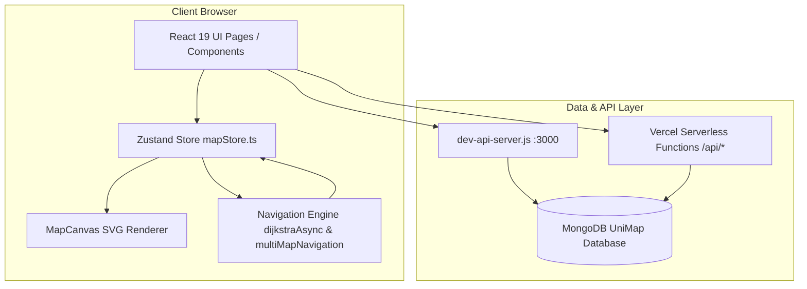

# 🏗️ UniMap Architecture Documentation

This document provides a comprehensive high-level architecture overview of the **UniMap** application structure, module breakdown, data flow, and system design.

---

## 📐 System Architecture Overview

UniMap follows a modular decoupled architecture:
- **Presentation Layer**: React 19 single-page app compiled with Vite.
- **State Layer**: Zustand central store for reactive state management.
- **Navigation Engine**: Graph algorithms (async Dijkstra pathfinding and multi-map route segmentation).
- **Data Access Layer**: Serverless Vercel function endpoints and local Node.js API server querying MongoDB.

---

## 🧩 Core Architecture Layers

### 1. Frontend Layer (`src/`)
- **Pages** (`src/pages/`): `LandingPage`, `MapPage`, `SupportPage`, `404`.
- **Map Components** (`src/components/map/`):
  - `MapCanvas.tsx`: Renders vector SVG maps with interactive pan/zoom, node pins, and animated SVG route polyline overlays.
  - `FloorSwitcher.tsx`: Controls building selection and active floor level.
  - `NodeMarker.tsx`: Displays spatial nodes on the SVG floor plane.
  - `RouteOverlay.tsx`: Draws calculated path vectors between connected route nodes.
- **Search & Navigation Controls** (`src/components/search/`, `src/components/route/`):
  - Autocomplete search inputs for start/destination selection.
  - Step-by-step route drawer and step-free accessibility toggles.

### 2. State Layer (`src/store/mapStore.ts`)
- Utilizes **Zustand** for lightweight, predictable global state.
- Stores:
  - `activeBuilding`, `activeFloor`, `activeFloorMap`
  - `selectedFrom`, `selectedTo` nodes
  - `currentRoute` (computed steps, total distance, estimated walking time)
  - `isLoading`, `error` network/computation states

### 3. Navigation Engine (`src/lib/`)
- **`dijkstra.ts`**: Implements a custom `MinHeap` priority queue and non-blocking `dijkstraAsync` algorithm. Yields to the main browser thread periodically during graph traversal to maintain 60 FPS UI performance.
- **`multiMapNavigation.ts`**: Converts raw node lists and edges into an interconnected global graph (`buildGlobalGraph`) and segments raw path sequences into floor-by-floor navigation steps (`segmentPathByMap`).
- **`navigation_instructions.ts`**: Analyzes spatial vectors between consecutive nodes to generate natural language turn-by-turn directions.

### 4. Backend & Data Layer (`api/` & `dev-api-server.js`)
- **Development Server (`dev-api-server.js`)**: Pure Node.js HTTP server running on port `3000` with MongoDB driver connectivity for local development.
- **Serverless API Handlers (`api/*.ts`)**: TypeScript handlers hosted on Vercel Serverless infrastructure:
  - `/api/nodes`: Returns array of `MapNode` records.
  - `/api/edges`: Returns array of `MapEdge` records.
  - `/api/buildings`: Returns building definitions and floor counts.
  - `/api/floors`: Returns floor map metadata and SVG URLs.
- **Database**: MongoDB database `UniMap` containing `nodes`, `edges`, `buildings`, and `floors` collections.
