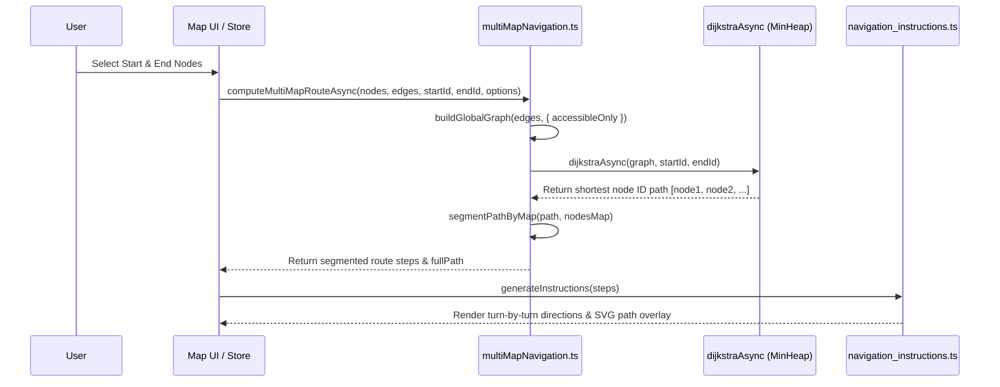

# UniMap Navigation Engine Documentation

This document explains the internal mechanics, graph algorithms, multi-map segmentation, and pathfinding logic powering **UniMap**.

---

## Navigation Flow Overview

When a user selects a starting location (`selectedFrom`) and a destination location (`selectedTo`), UniMap executes the following multi-stage pipeline:



---

## Core Components

### 1. Global Graph Assembly (`buildGlobalGraph`)
Located in `src/lib/multiMapNavigation.ts`.
- Converts raw database edges into an adjacency list representation (`DijkstraGraph`).
- **Bidirectional Edges**: Every edge $(u, v)$ with distance $w$ automatically inserts both $u \to v$ and $v \to u$.
- **Accessibility Filter**: When `accessibleOnly: true` is set, edges with `type === 'stairs'` are excluded during graph construction, forcing the path through elevators or ramp transitions.

```typescript
export function buildGlobalGraph(
  navigationEdges: MapEdge[],
  options: { accessibleOnly?: boolean } = {}
): DijkstraGraph
```

---

### 2. Non-Blocking Dijkstra Pathfinding (`dijkstraAsync`)
Located in `src/lib/dijkstra.ts`.
- **MinHeap Priority Queue**: Custom binary min-heap implementation guarantees $O((V + E) \log V)$ time complexity.
- **Main Thread Yielding**: Large graphs can cause frame drops if Dijkstra runs synchronously. `dijkstraAsync` checks elapsed execution time continuously and yields execution via `requestAnimationFrame` (or `setTimeout(0)`) when computation exceeds ~10ms per chunk.
- **Cancellation**: Supports `AbortSignal` to cancel outdated pathfinding tasks when the user rapidly changes destinations.

---

### 3. Multi-Map Path Segmentation (`segmentPathByMap`)
Located in `src/lib/multiMapNavigation.ts`.
- Maps in UniMap represent individual floors or outdoor campus grounds.
- `segmentPathByMap` iterates through the computed node sequence and splits the path whenever a node's `map` identifier changes (e.g. transition from `main_ground_floor` to `main_1st_floor` via a staircase/lift node).
- Generates discrete `NavigationStep` objects containing start node, end node, floor map ID, and array of nodes for that specific map step.

---

### 4. Turn-by-Turn Instruction Engine (`navigation_instructions.ts`)
Located in `src/lib/navigation_instructions.ts`.
- Evaluates spatial coordinates $(X, Y)$ and edge types across path nodes to generate clear human-readable instructions:
  - *"Turn left at Main Corridor Junction"*
  - *"Take elevator to Floor 2"*
  - *"Head straight towards Room 104"*
