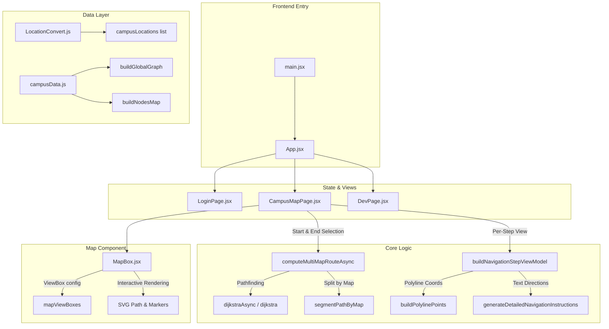

# UniMap-V1 Technical Analysis Report

UniMap is a graph-based indoor campus navigation system designed to convert a static campus layout into a structured, traversable graph. It handles shortest-path routing, real-time multi-floor route segmentation, and dynamic SVG-based route visualization without third-party mapping SDKs.

This document provides a comprehensive analysis of the architecture, data design, core algorithms, and optimizations implemented in **UniMap-V1**.

---

## Architectural Overview

UniMap-V1 is built as a single-page React application powered by Vite, utilizing modular utility functions and styled with Tailwind CSS v4. The system is designed to compute routes locally on a pre-compiled campus graph, splitting paths across multiple maps (floors) dynamically.



---

## Technology Stack

The application relies on a modern frontend stack optimized for smooth vector graphics rendering and fluid animations:

| Layer | Technologies | Purpose |
| :--- | :--- | :--- |
| **Frontend Framework** | React 18.3.1, Vite 6.3.5 | Fast compilation, reactive component architecture, lazy-loaded page modules. |
| **Styling** | Tailwind CSS v4.1.12, Vanilla CSS | CSS-in-JS utility styles and layered components (`components.css`, `theme.css`). |
| **Animations** | Motion (formerly Framer Motion) | Fluid page transitions, search dropdown fade-ins, and animated route drawing. |
| **Icons** | Lucide React | Clean, scalable vector icons for UI layout and directions. |
| **UI Components** | Radix UI Primitive library | Headless, accessible base components (dropdown-menu, slot, avatar). |
| **Routing Logic** | Custom Adjacency Graph + Dijkstra | Graph traversal, weight-based calculations, and turn-by-turn instruction generation. |
| **Map Rendering** | SVG overlay + HTML5 image layer | Lightweight, scalable rendering; supports pinch-zoom, panning, and path overlays. |

---

## Graph Data Model & Conversion

UniMap does not treat maps as simple images, but as mathematical networks consisting of **Nodes** (positions) and **Edges** (walkways).

### 1. Data Segmentations (`src/app/data/nodes/` and `src/app/data/edges/`)
The campus is divided into distinct zones, each having its own node and edge JSON files:
*   **Campus**: `campus_nodes.js` and `campus_edges.js` (outer pathways, gates, and building entrance connections).
*   **Main Building**: 3 floors (`main_gf`, `main_ff`, `main_sf` nodes & edges).
*   **AI Building**: 3 floors (`ai_gf`, `ai_ff`, `ai_sf` nodes & edges).

### 2. Aggregation & Flattening (`src/app/data/campusData.js`)
All zones are imported into a central registry (`mapDatasets`). For global pathfinding, nodes and edges are flattened into unified arrays:
```javascript
export const navigationNodes = Object.values(mapDatasets).flatMap(dataset => dataset.nodes);
export const navigationEdges = Object.values(mapDatasets).flatMap(dataset => dataset.edges);
```

### 3. Location Filtering & Parsing (`LocationConvert.js` & `parseRoomName.js`)
*   **Filtering**: Not all graph nodes are meaningful to the user. Corridor joints and pathing intersections are filtered out from search results:
    ```javascript
    .filter((n) => n.type !== 'corridor' && n.type !== 'intersection')
    ```
*   **Parsing**: Room categories (Labs, Offices, Washrooms, Classrooms) are automatically deduced using regex rules in `parseRoomName.js`:
    ```javascript
    const CATEGORIES = [
      [/Lab/i, 'Lab'],
      [/Office|Dean|HOD|Department|Dr\.|Prof\.|Ar\./i, 'Office'],
      [/Studio/i, 'Studio'],
      [/LT-|Lecture/i, 'Classroom'],
      [/Washroom/i, 'Washroom'],
      [/SH-|^PL-/, 'Common'],
      [/Centre|Center/i, 'Facility']
    ];
    ```

---

## Core Traversal & Pathfinding Logic

The pathfinding system utilizes a custom implementation of **Dijkstra's Algorithm**.

### 1. Heap-Optimized Traversal (`src/utils/dijkstra.js`)
Rather than doing linear searches, the engine implements a custom binary `MinHeap` in pure JS, reducing the complexity of node expansions to $O(E \log V)$.

> [!NOTE]
> The algorithm does not require a complex "decrease-key" implementation; it simply pushes updated distances to the heap and skips stale elements during extraction:
> `if (d !== distances[u]) continue; // stale entry`

### 2. Responsive UI Thread Execution
To prevent long-running traversals from locking up the browser UI thread (which is critical during complex multi-floor paths), Dijkstra supports an asynchronous version (`dijkstraAsync`) that yields back to the main thread:
```javascript
if (performance.now() - lastYieldTime > 10) {
  await yieldToMainThread();
  lastYieldTime = performance.now();
}
```
*`yieldToMainThread` defaults to `requestAnimationFrame` to run synchronously with browser paint cycles, falling back to a `setTimeout` of 0.*

### 3. Nearest Facility Target Mode (`dijkstraDistances.js`)
For finding resources (like the nearest restroom), running a standard Dijkstra to all nodes is wasteful. `dijkstraDistancesAsync` contains a **Targeted Mode**:
*   A target set is created from candidate washrooms.
*   The search halts immediately once all targets in the set have been finalized by the heap:
    ```javascript
    if (targetSet.has(u) && !finalizedTargets.has(u)) {
      finalizedTargets.add(u);
      if (finalizedTargets.size >= targetSet.size) break;
    }
    ```

---

## Multi-Map Route Segmentation & Rendering

Because paths can cross building thresholds and floor changes, the pathfinder splits a single route into sequential segments.

### 1. Map-Agnostic Graph (`src/utils/multiMapNavigation.js`)
A global graph is built bidirectionally from all edges. Transition edges (e.g., stairs or elevators) connect nodes on different maps.

### 2. Segmenting the Route
The flat array of nodes returned by Dijkstra is parsed. Whenever the `map` property changes between adjacent nodes, a map boundary is created:
```javascript
for (let i = 1; i < path.length; i++) {
  const nodeMap = nodesMap[path[i]]?.map;
  if (nodeMap !== currentMap) {
    // Split: Save previous segment, start new step on next map
  }
}
```

### 3. Turn-by-Turn Instruction Generator (`src/utils/navigation_instructions.js`)
Turn directions are calculated using vector mathematics between three consecutive nodes: $p1 \to p2 \to p3$.
*   **Angle Calculation**: Uses `Math.atan2` to find the angle between vectors:
    ```javascript
    const v1 = { x: p2.x - p1.x, y: p2.y - p1.y };
    const v2 = { x: p3.x - p2.x, y: p3.y - p2.y };
    const angle1 = Math.atan2(v1.y, v1.x);
    const angle2 = Math.atan2(v2.y, v2.x);
    let angle = (angle2 - angle1) * (180 / Math.PI);
    ```
*   **Coordinate Adjustment**: The Y-axis on computer displays and SVGs points downwards. To prevent left and right turns from being reversed, the calculated angle is negated before turn classification:
    ```javascript
    const flipped = -angle; // Adjust for screen coordinate system
    ```
*   **Distance Scale**: Approximately 10 SVG coordinate units correspond to 1 meter in real space: `distanceInMeters = Math.round(totalDist / 10)`.

---

## Interactive Map Rendering (`MapBox.jsx`)

The core map view handles fluid SVG layouts and complex user interactions.

```text
+-------------------------------------------------------------+
|  MapBox Container (Interactive zoom & pan gestures)         |
|  +-------------------------------------------------------+  |
|  | Base Floor Plan Image (SVG asset loaded dynamically)  |  |
|  +-------------------------------------------------------+  |
|  | SVG Overlay Layer (z-index: 10)                       |  |
|  |  * <polyline> - Animating blue navigation path        |  |
|  |  * <circle> - Green Pulse (Current Location marker)    |  |
|  |  * <circle> - Blue Pulse (Destination marker)         |  |
|  +-------------------------------------------------------+  |
+-------------------------------------------------------------+
```

### 1. ViewBox Matching (`mapAssets.js`)
Because every floor plan has unique dimensions, the aspect ratio must match the source SVG coordinates. This is resolved via a lookup dictionary (`mapViewBoxes`):
```javascript
export const mapViewBoxes = {
  Campus_Map: { width: 1088.7814, height: 659.5655 },
  Main_GF:    { width: 848.4096,   height: 609.5946 },
  // ...
};
```

### 2. Auto-Centering and Zoom Fitting (`MapBox.jsx`)
When a route is loaded, the map automatically fits the computed path within the container boundaries:
1.  Computes a bounding box (`pathBbox`) around all nodes in the active segment.
2.  Maps SVG coordinates to current screen pixels.
3.  Calculates an optimal scale factor (`nextZoom`) so that the route stays centered with a padding margin.
4.  Updates states: `nextPanX` and `nextPanY` centring the target bounding box.

### 3. Gesture Controls & Smooth Panning
The interactive panel supports double-finger pinch zoom and single-finger panning.
*   **Midpoint Locking**: When zooming with two fingers, the midpoint between the fingers remains locked, ensuring the zoom occurs relative to the user's focus point.
*   **rAF Throttling**: Interactive movements are throttled inside a `requestAnimationFrame` loop, preventing layout thrashing and maintaining a stable 60 FPS:
    ```javascript
    const commitGestureUpdate = (next) => {
      gestureRef.current.pending = next;
      if (gestureRef.current.rafId) return;
      gestureRef.current.rafId = requestAnimationFrame(() => {
        // Apply zoom and pan state updates
      });
    };
    ```

---

## Engineering Highlights & Optimizations

*   **Cancelable Computations**: To prevent slower devices from processing outdated path computations when typing rapidly or clicking destinations, the hooks use `AbortController` signals to cancel asynchronous loops immediately.
*   **Least Recently Used (LRU) Distance Caching**: The `useNearestWashroom` hook caches calculated distances from a starting node to avoid running Dijkstra repeatedly. The cache size is bounded to 4 to prevent memory leaks:
    ```javascript
    if (distancesCacheRef.current.size > maxCacheSize) {
      const oldestKey = distancesCacheRef.current.keys().next().value;
      distancesCacheRef.current.delete(oldestKey);
    }
    ```
*   **Asset Prefetching**: To ensure floor transitions feel instantaneous, the map component guesses the user's next steps and preloads adjacent floor SVGs:
    ```javascript
    useEffect(() => {
      if (mapId === 'Main_GF') preloadMapAsset('Main_FF');
      if (mapId === 'Main_FF') preloadMapAsset('Main_SF');
    }, [mapId]);
    ```
*   **Vite Proxies**: Development configuration (`vite.config.js`) includes API proxies for `/auth` and `/logout` targeting `VITE_API_URL` (defaulting to localhost:5000), separating the client bundle from the backend server.
